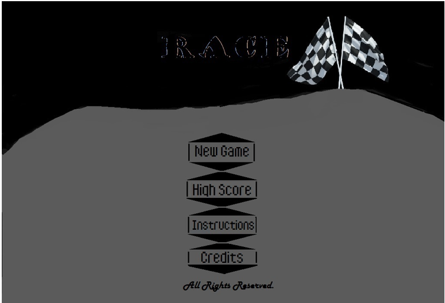
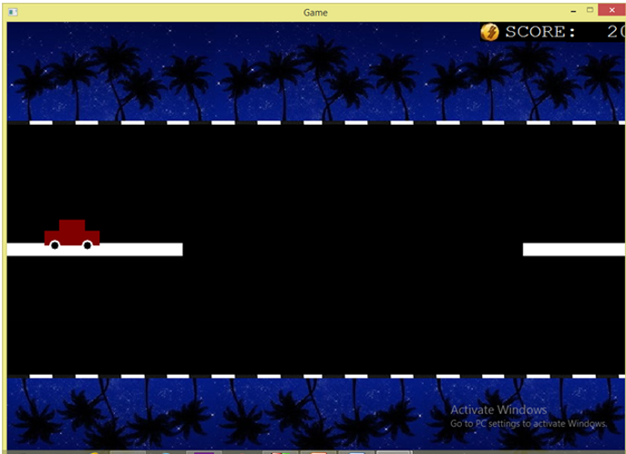
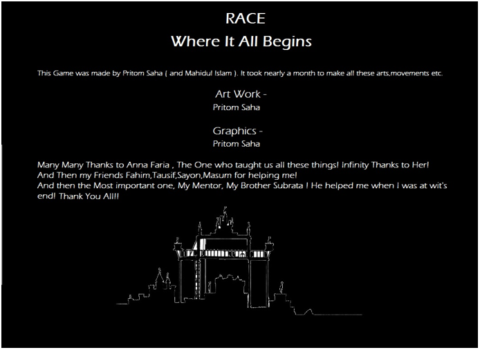

# Race - Where It All Begins

## Project Overview
This project is a 2D car racing game built using **C/C++** and the **BGI (Borland Graphics Interface)** library. The game features multiple levels, enemy cars, and a score-keeping system. It was designed as a part of a programming lab project.

## Features
- **Multiple Levels**: The game features eight levels, each more challenging than the last, with increasing speeds for enemy cars.
- **Enemy Cars**: Various enemy cars are drawn with different colors, making it harder to avoid collisions.
- **Main Menu Options**:
  - **New Game**: Start a new race.
  - **High Scores**: View previous high scores.
  - **Instructions**: Learn how to play the game.
  - **Credits**: View the project credits.
- **Scoring System**: Players can gain or lose points based on their performance. The score increases with each level and decreases when hitting enemy cars.
- **Collision Detection**: The game has robust collision detection, where hitting an enemy car decreases the player's score and eventually ends the game after eight collisions.

## Game Rules
1. The player's car can move in four directions: up, down, left, and right.
2. The objective is to avoid enemy cars and reach the destination at the end of each level.
3. The game ends after eight collisions with enemy cars.
4. With every 60 points scored, the player moves to the next level, up to a total of eight levels.

## Game Play
- Use the arrow keys to navigate the car.
- Press the "New Game" option to start the race.
- Enemy cars appear randomly and increase in speed as levels progress.
- Score is displayed on the screen during gameplay, and life decreases with each collision.
  
## How to Play
1. Use directional buttons to navigate the menu.
2. Press **"New Game"** to start playing.
3. Control the car using the arrow keys to avoid enemy cars.
4. Avoid enemy cars to stay alive and increase your score.
5. Press **"High Scores"** to view the leaderboard.
6. The game ends when the player runs out of lives or reaches the final level.

## Flow Chart
The flow chart of the game shows the different states of the game from the menu to gameplay, collisions, and scorekeeping. Each part of the game is modular and handled by various functions.

## Built-In Functions
The game uses various BGI built-in functions, such as:
- **bar()**: Draws a filled-in rectangle (used for drawing cars, roads, etc.).
- **circle()**: Draws a circle (used for car wheels).
- **setcolor()**: Sets the color for drawing objects.
- **outtextxy()**: Displays text on the screen at a specific position.

## Screenshots

### 1. Menu Screen

### 2. Playing the Game (Level 1)

### 3. Credits

## Limitations
1. **BGI Library Limitations**: The BGI library has limitations in performance, and the game may slow down at higher levels or with larger datasets.
2. **Debugging Challenges**: Debugging graphics-related code in BGI can be time-consuming, especially when handling collisions and animations.

## Conclusion
This project showcases a simple 2D racing game built with **C/C++** using the **BGI** library. It was a challenging yet rewarding project, helping us gain a deeper understanding of graphical programming and collision detection.

## Credits
- **Pritom Saha** (Roll 56)
